# Tugas Database - Query SQL

## 👤 Identitas Diri
- Nama  : Isnaeni Kholifatun
- NIM   : 60324075
- Kelas : B
- Mata Kuliah : Pemograman WEB 2
- Prodi : Informatika

---

## Deskripsi
Tugas ini bertujuan untuk melakukan eksplorasi database perpustakaan menggunakan query SQL, meliputi statistik, filtering, agregasi, update data, dan pembuatan laporan.

---

## 📊 Statistik Buku

### 1. Total Buku
Menampilkan jumlah seluruh buku dalam tabel.
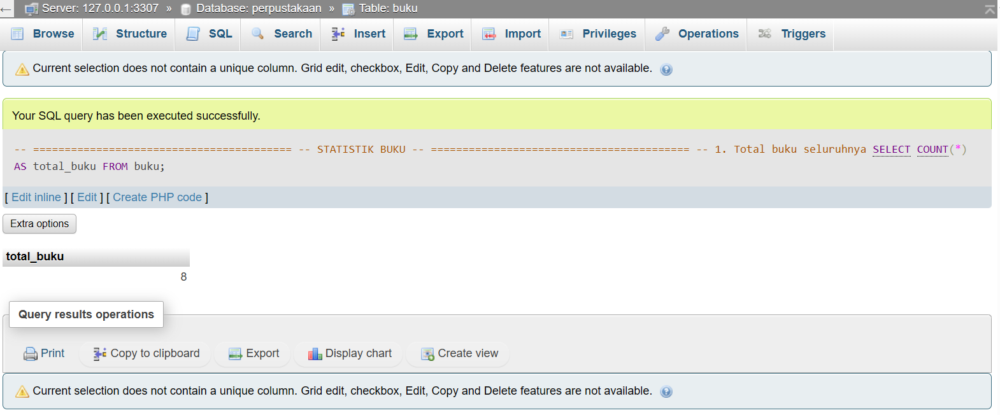

### 2. Total Inventaris
Menghitung total nilai inventaris (harga × stok).
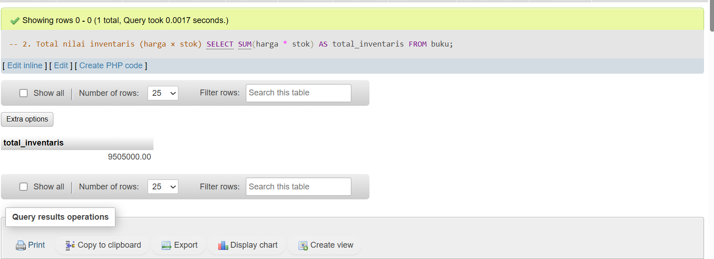

### 3. Rata-rata Harga
Menampilkan rata-rata harga semua buku.
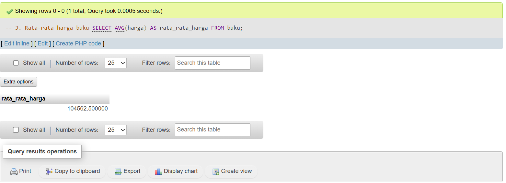

### 4. Buku Termahal
Menampilkan buku dengan harga tertinggi.
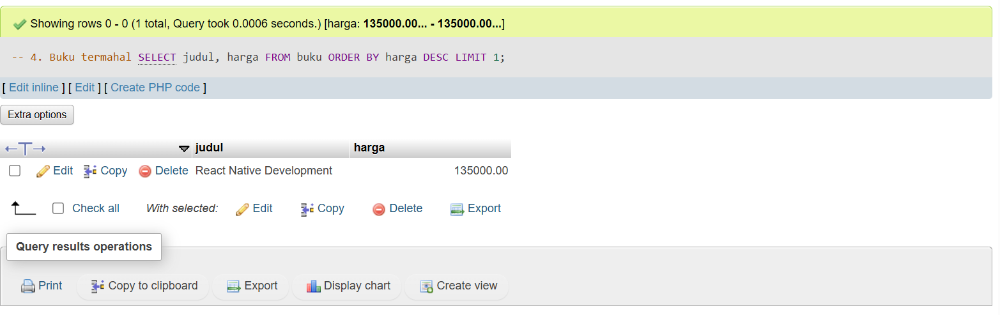

### 5. Stok Terbanyak
Menampilkan buku dengan stok paling banyak.
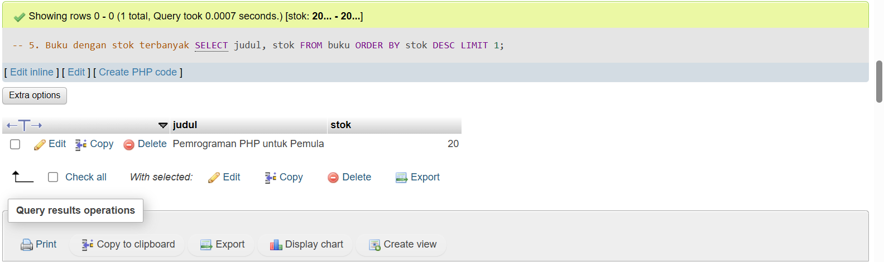

---

## 🔍 Filter dan Pencarian

### 6. Buku Programming < 100000
Menampilkan buku kategori Programming dengan harga kurang dari 100000.
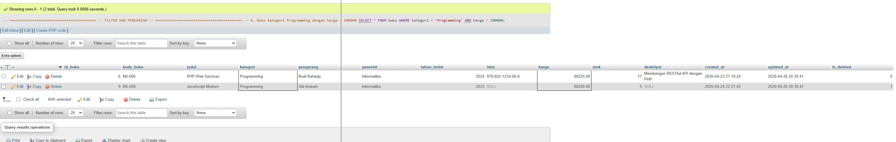

### 7. Judul PHP/MySQL
Menampilkan buku yang judulnya mengandung kata PHP atau MySQL.
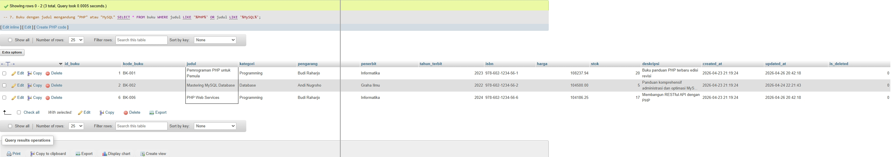

### 8. Tahun 2024
Menampilkan buku yang terbit pada tahun 2024.
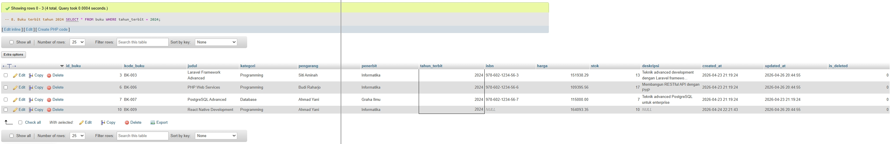

### 9. Stok 5-10
Menampilkan buku dengan stok antara 5 sampai 10.
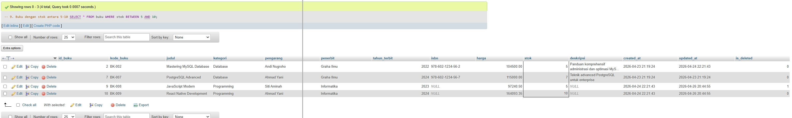

### 10. Pengarang Budi Raharjo
Menampilkan buku dengan pengarang Budi Raharjo.
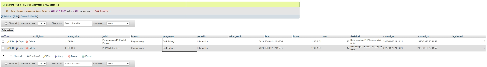

---

## 📊 Grouping dan Agregasi

### 11. Jumlah per Kategori
Menampilkan jumlah buku dan total stok berdasarkan kategori.
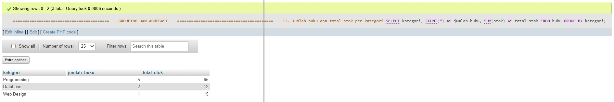

### 12. Rata-rata per Kategori
Menampilkan rata-rata harga buku pada setiap kategori.
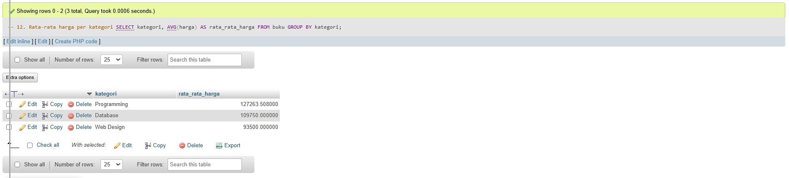

### 13. Inventaris Terbesar
Menampilkan kategori dengan total nilai inventaris terbesar.
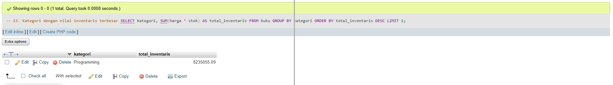

---

## ✏️ Update Data

### 14. Update Harga
Menaikkan harga buku kategori Programming sebesar 5%.
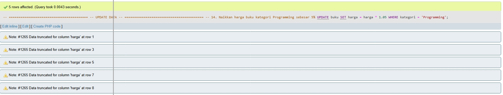

### 15. Update Stok
Menambahkan stok 10 untuk buku yang stoknya kurang dari 5.
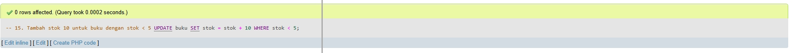

---

## 📋 Laporan Khusus

### 16. Restocking
Menampilkan buku yang perlu restocking (stok kurang dari 5).
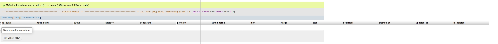

### 17. Top 5 Termahal
Menampilkan 5 buku dengan harga tertinggi.
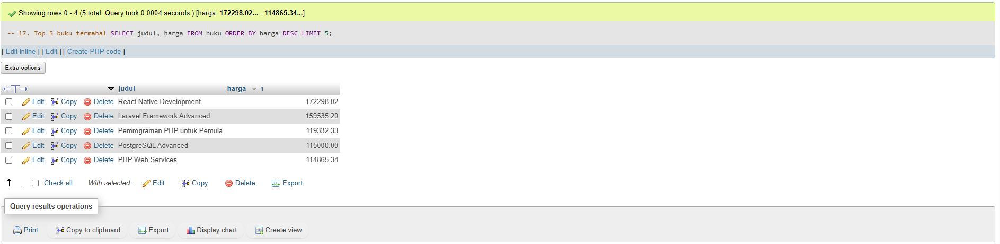

## 🏗️ Struktur dan Relasi Database

### 18. Entity Relationship Diagram (ERD)
Hubungan antar tabel dalam database perpustakaan.
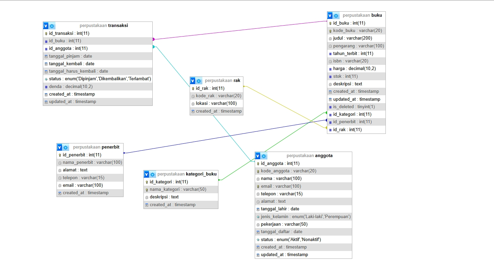

### 19. Skema Tabel (Structure)
Detail kolom dan tipe data dari masing-masing tabel:
- **Struktur Buku**: 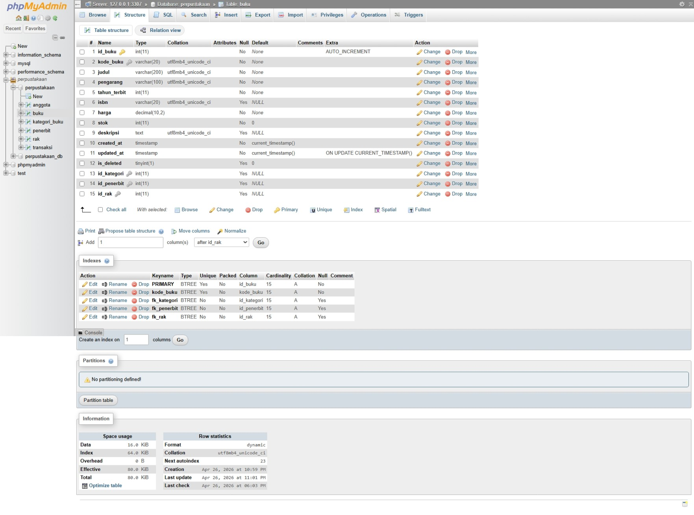
- **Struktur Kategori**: 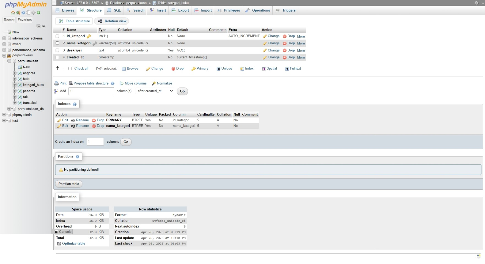
- **Struktur Penerbit**: 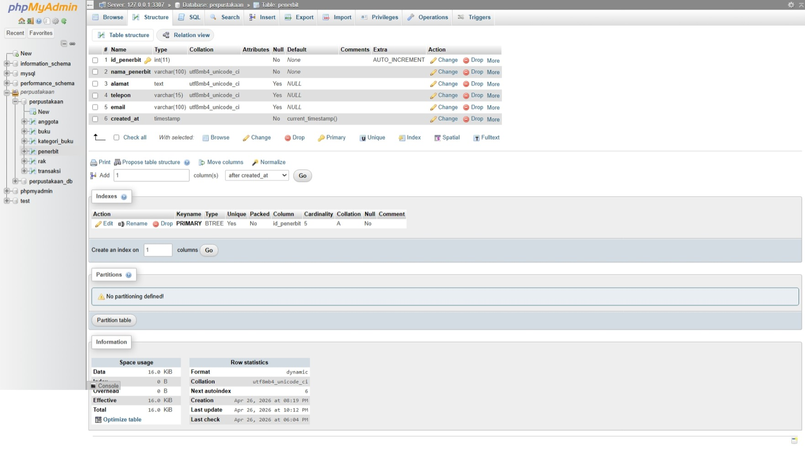
- **Struktur Rak**: 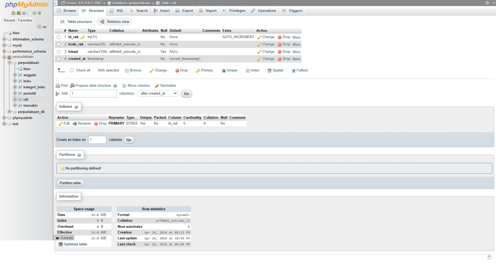

---

## 💾 Data Master (Data Dump)

### 20. Isi Tabel Database
Tampilan data yang telah diinputkan ke dalam sistem:
- **Data Buku**: 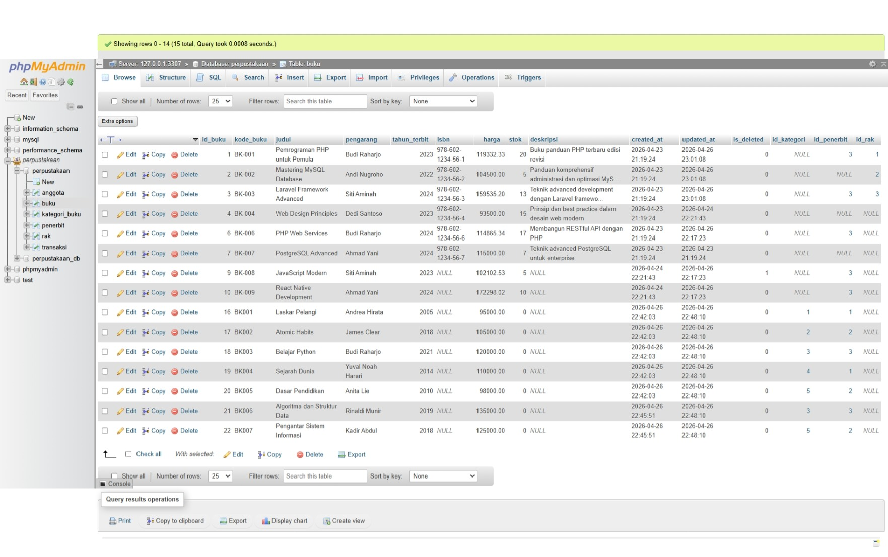
- **Data Kategori**: 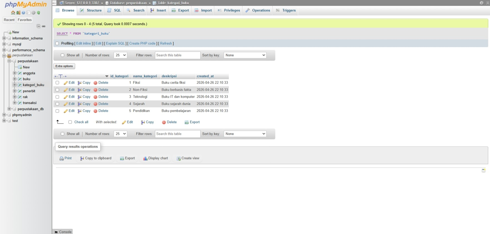
- **Data Penerbit**: 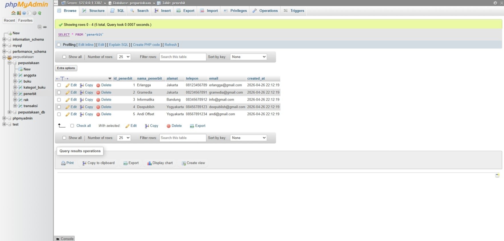
- **Data Rak**: 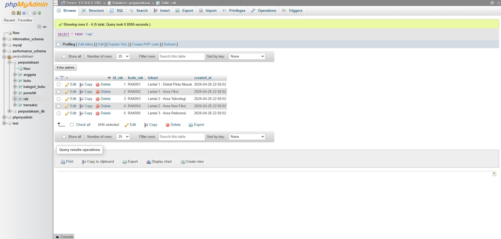

---

## 🔗 Laporan Join Terpadu

### 21. Hasil Query Join
Laporan lengkap yang menggabungkan tabel buku, kategori, penerbit, dan rak.
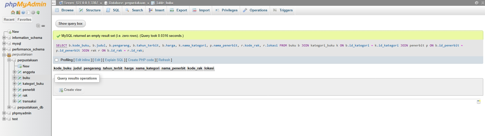