# Tugas Database - Query SQL

## 👤 Identitas Diri
- Nama  : Isnaeni Kholifatun
- NIM   : 60324075
- Kelas : B
- Mata Kuliah : Pemograman WEB 2
- Prodi : Informatika

---

## Deskripsi
Tugas ini bertujuan untuk melakukan eksplorasi database perpustakaan menggunakan query SQL, meliputi statistik, filtering, agregasi, update data, dan pembuatan laporan.

---

## 📊 Statistik Buku

### 1. Total Buku
Menampilkan jumlah seluruh buku dalam tabel.

```sql
SELECT COUNT(*) AS total_buku FROM buku;
```


### 2. Total Inventaris
Menghitung total nilai inventaris (harga × stok).
```sql
SELECT SUM(harga * stok) AS total_inventaris FROM buku;
```


### 3. Rata-rata Harga
Menampilkan rata-rata harga semua buku.
```sql
SELECT AVG(harga) AS rata_rata_harga FROM buku;
```


### 4. Buku Termahal
Menampilkan buku dengan harga tertinggi.
```sql
SELECT judul, harga 
FROM buku 
ORDER BY harga DESC 
LIMIT 1;
```


### 5. Stok Terbanyak
Menampilkan buku dengan stok paling banyak.
```sql
SELECT judul, stok 
FROM buku 
ORDER BY stok DESC 
LIMIT 1;
```


---

## 🔍 Filter dan Pencarian

### 6. Buku Programming < 100000
Menampilkan buku kategori Programming dengan harga kurang dari 100000.
```sql
SELECT * 
FROM buku 
WHERE kategori = 'Programming' AND harga < 100000;
```


### 7. Judul PHP/MySQL
Menampilkan buku yang judulnya mengandung kata PHP atau MySQL.
```sql
SELECT * 
FROM buku 
WHERE judul LIKE '%PHP%' OR judul LIKE '%MySQL%';
```


### 8. Tahun 2024
Menampilkan buku yang terbit pada tahun 2024.
```sql
SELECT * 
FROM buku 
WHERE tahun_terbit = 2024;
```


### 9. Stok 5-10
Menampilkan buku dengan stok antara 5 sampai 10.
```sql
SELECT * 
FROM buku 
WHERE stok BETWEEN 5 AND 10;
```


### 10. Pengarang Budi Raharjo
Menampilkan buku dengan pengarang Budi Raharjo.
```sql
SELECT * 
FROM buku 
WHERE pengarang = 'Budi Raharjo';
```


---

## 📊 Grouping dan Agregasi

### 11. Jumlah per Kategori
Menampilkan jumlah buku dan total stok berdasarkan kategori.
```sql
SELECT kategori, COUNT(*) AS jumlah_buku, SUM(stok) AS total_stok
FROM buku
GROUP BY kategori;
```


### 12. Rata-rata per Kategori
Menampilkan rata-rata harga buku pada setiap kategori.
```sql
SELECT kategori, AVG(harga) AS rata_rata_harga
FROM buku
GROUP BY kategori;
```


### 13. Inventaris Terbesar
Menampilkan kategori dengan total nilai inventaris terbesar.
```sql
SELECT kategori, SUM(harga * stok) AS total_inventaris
FROM buku
GROUP BY kategori
ORDER BY total_inventaris DESC
LIMIT 1;
```


---

## ✏️ Update Data

### 14. Update Harga
Menaikkan harga buku kategori Programming sebesar 5%.
```sql
UPDATE buku
SET harga = harga * 1.05
WHERE kategori = 'Programming';
```


### 15. Update Stok
Menambahkan stok 10 untuk buku yang stoknya kurang dari 5.
```sql
UPDATE buku
SET stok = stok + 10
WHERE stok < 5;
```


---

## 📋 Laporan Khusus

### 16. Restocking
Menampilkan buku yang perlu restocking (stok kurang dari 5).
```sql
SELECT * 
FROM buku 
WHERE stok < 5;
```


### 17. Top 5 Termahal
Menampilkan 5 buku dengan harga tertinggi.
```sql
SELECT judul, harga 
FROM buku 
ORDER BY harga DESC 
LIMIT 5;
```


## 🏗️ Struktur dan Relasi Database

### 18. Entity Relationship Diagram (ERD)
Hubungan antar tabel dalam database perpustakaan.
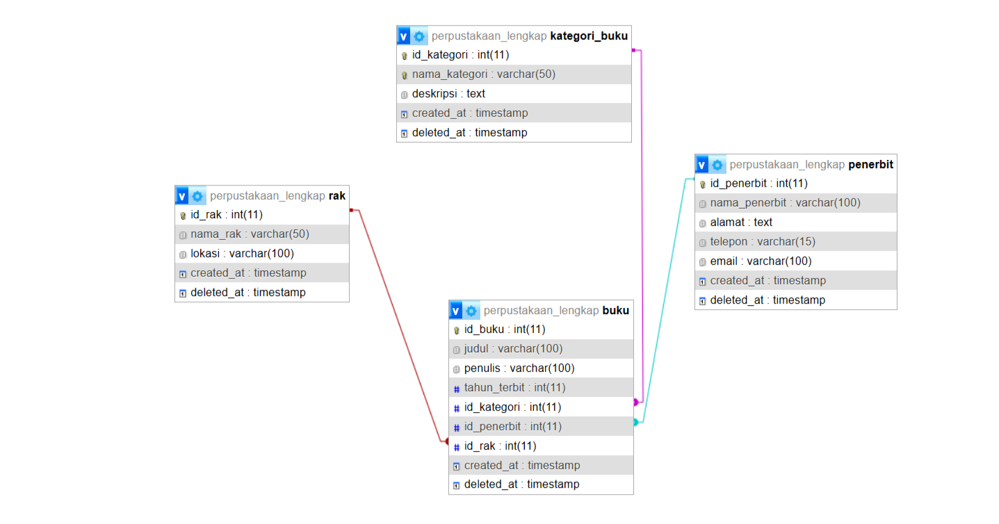

### 19. Skema Tabel (Structure)
Detail kolom dan tipe data dari masing-masing tabel:
- **Struktur Buku**: 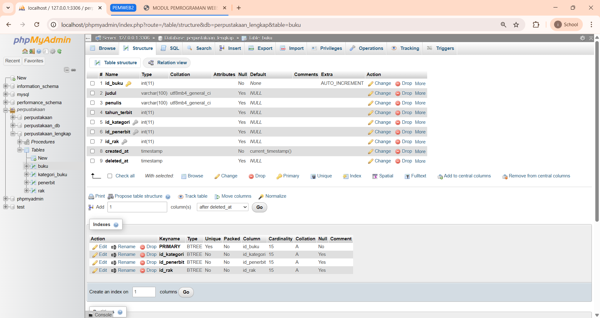
- **Struktur Kategori Buku**: 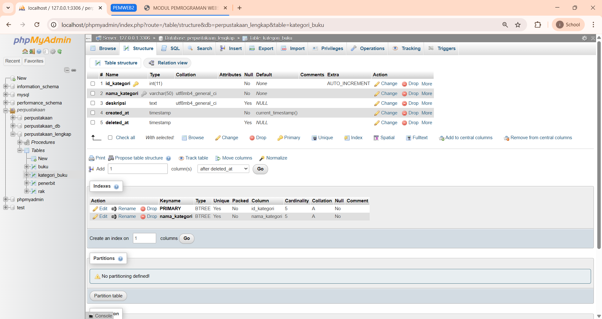
- **Struktur Penerbit**: 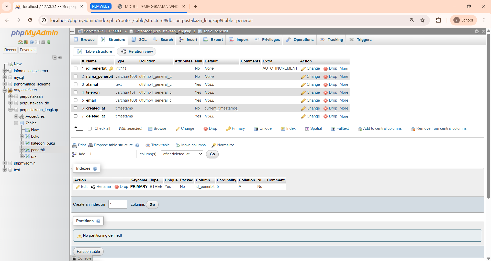
- **Struktur Rak**: 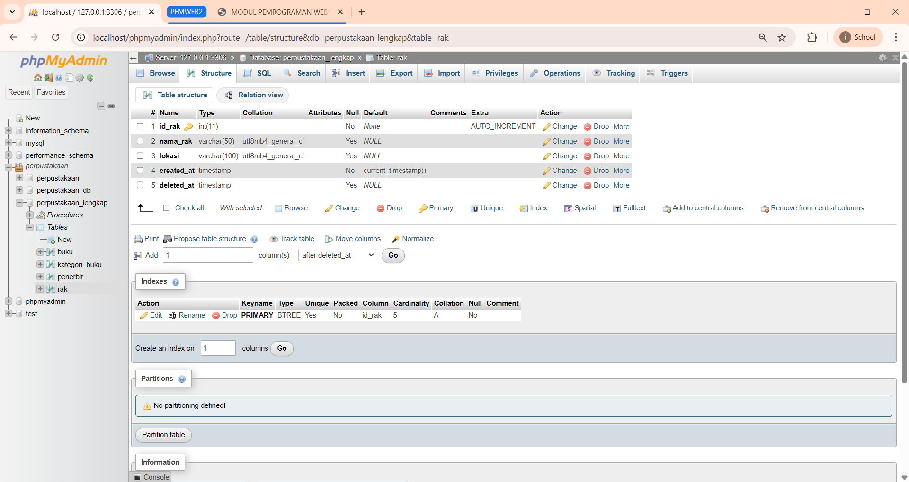

---

## 💾 Data Master (Data Dump)

### 20. Isi Tabel Database
Tampilan data yang telah diinputkan ke dalam sistem:
- **Data Buku**: 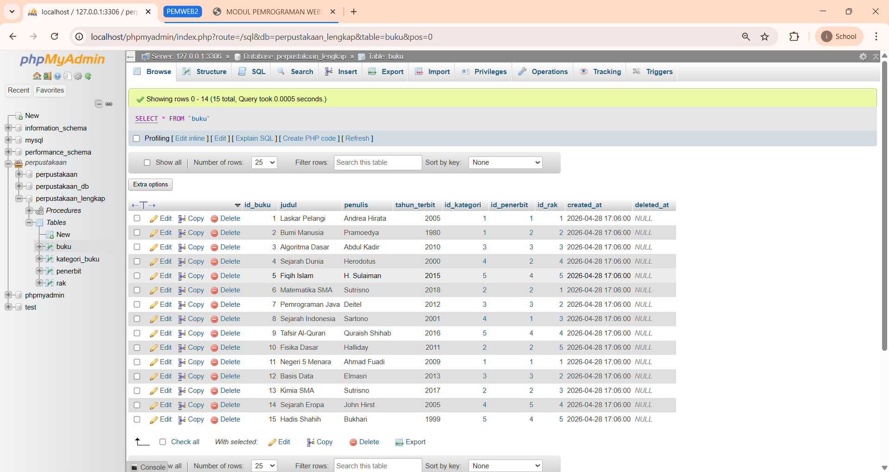
- **Data Kategori Buku**: 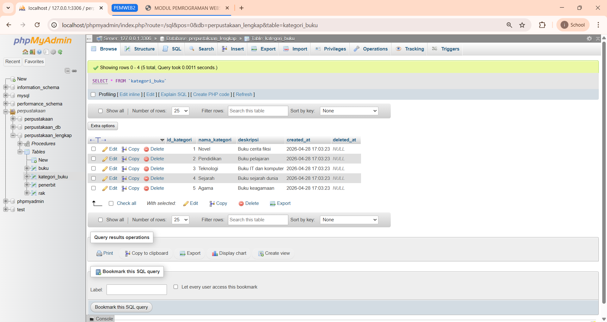
- **Data Penerbit**: 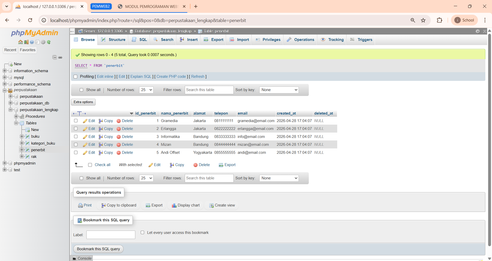
- **Data Rak**: 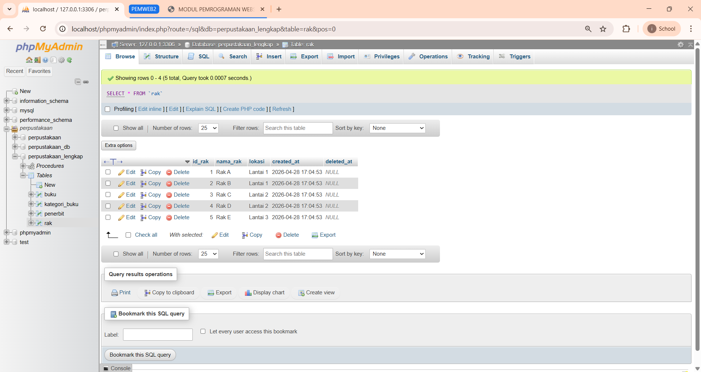

---

## 🔗 Laporan Join Terpadu

### 21. Hasil Query Join 
Laporan lengkap yang menggabungkan tabel buku, kategori, penerbit, dan rak.
- **Query join** :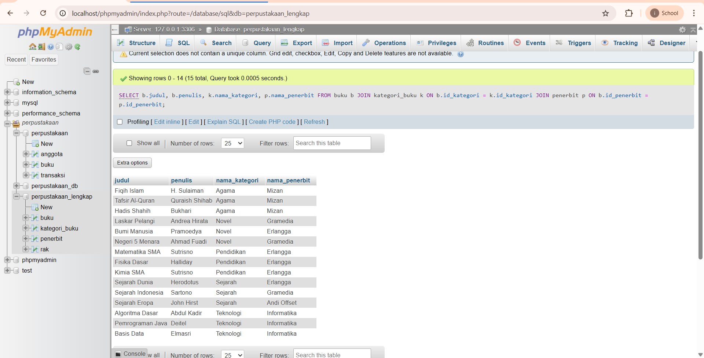
- **Jumlah buku perkategori** :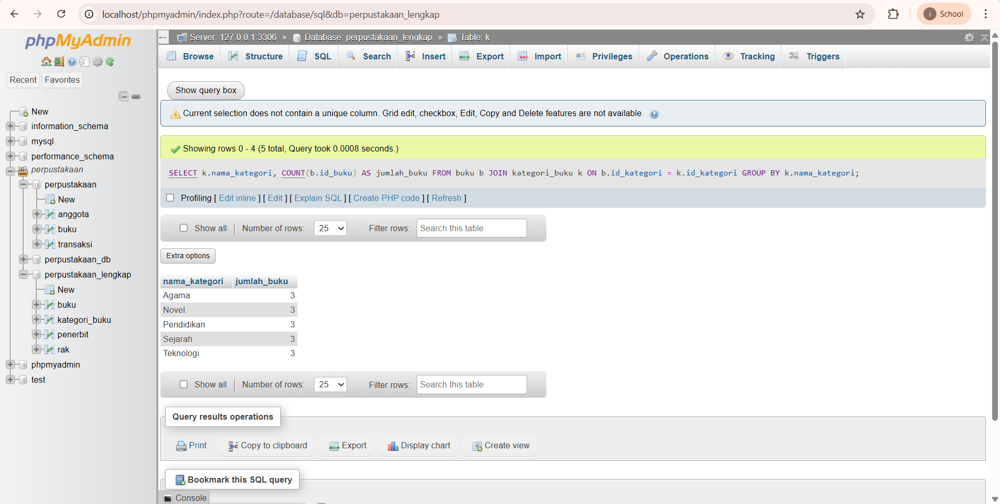
- **Jumlah buku perpenerbit** :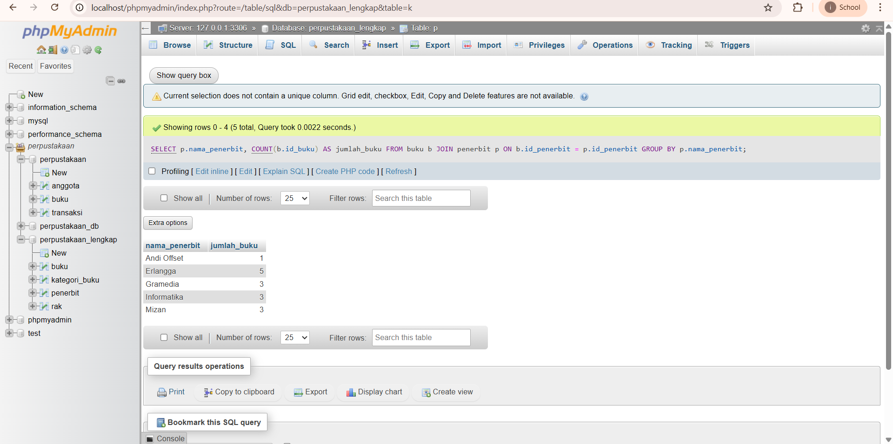
- **Detail lengkap buku** :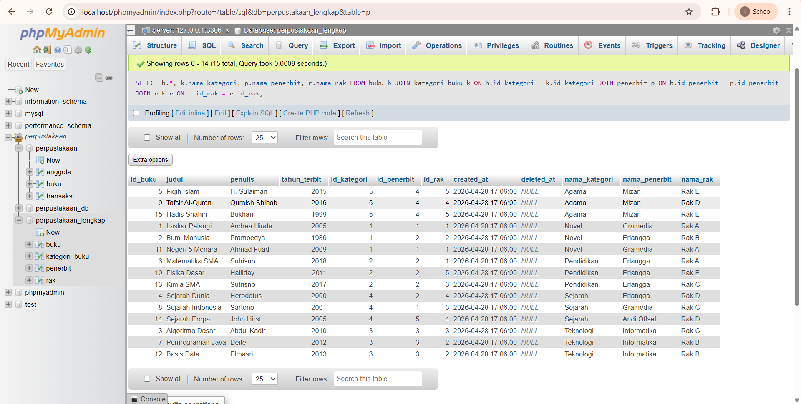